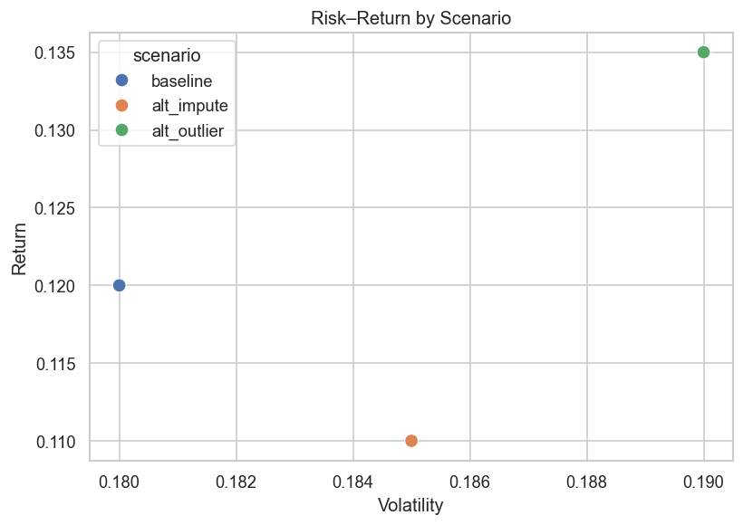
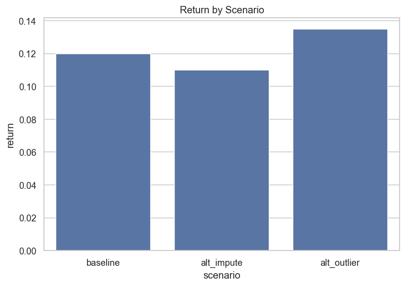
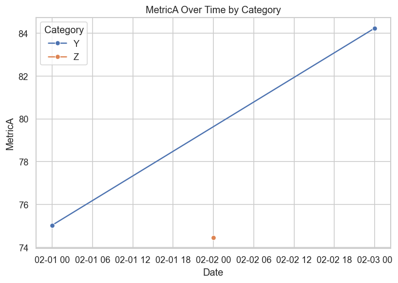

# Final Report

## Executive Summary
- Outlier removal yields the highest return but comes with higher volatility.  
- Imputation lowers return while slightly increasing volatility.  
- Results are sensitive to data-processing assumptions, so decisions should not rely on one scenario alone.

---

## Chart 1: Risk–Return by Scenario
 
Baseline shows balanced risk and return. Imputation reduces return while slightly increasing volatility. Outlier removal improves return but adds more volatility.  
**Takeaway:** Stakeholders must weigh higher return against higher risk.

---

## Chart 2: Return by Scenario
 
Returns range from 0.11 to 0.135 depending on scenario. Methodological choices significantly affect measured outcomes.  
**Takeaway:** Transparency in assumptions is critical as small data decisions can change conclusions.

---

## Chart 3: MetricA Over Time by Category

MetricA rises steadily for Category Y but remains flat for Category Z.  
**Takeaway:** Improvements are uneven across categories and not uniform.

---

## Assumptions & Risks
- **Fill Nulls (Median):** return drops from 0.12 to 0.10  
- **Remove Outliers (3σ):** return rises from 0.12 to 0.14  
**Risk:** Results change significantly depending on how missing values or outliers are treated.

---

## Sensitivity Analysis
| Assumption             | Baseline Return | Alt Scenario Return |
|-------------------------|-----------------|---------------------|
| Fill Nulls: Median      | 0.12            | 0.10                |
| Remove Outliers: 3σ     | 0.12            | 0.14                |

**Insight:** Outcomes are highly sensitive to data-processing assumptions.

---

## Decision Implications
- Outlier removal offers higher return but also higher volatility; suitable if risk tolerance is high.  
- Imputation provides stability but reduces returns; suitable if priority is risk control.  
- Decisions should consider robustness under multiple scenarios.  
- Recommended next step: test decisions under different assumptions before committing.

