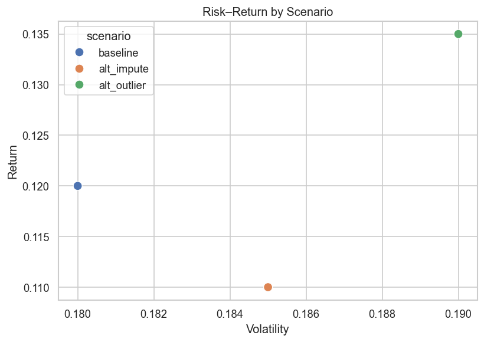
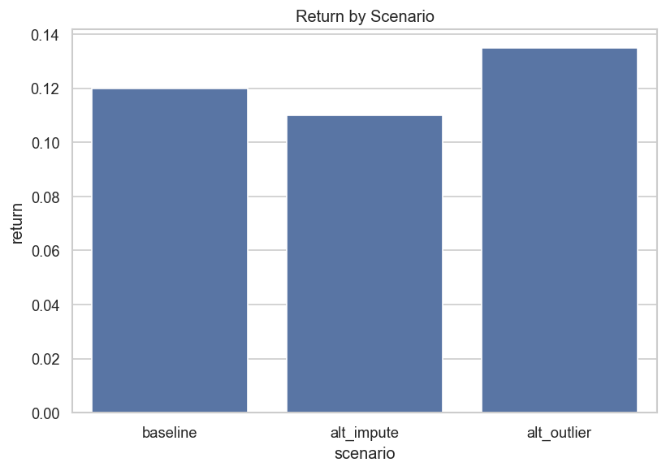
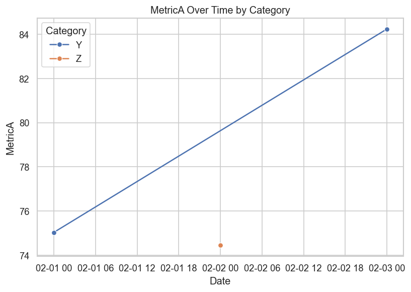

# Deliverables README

## Audience
The intended audience is non-technical stakeholders (e.g., managers or decision-makers) who need to understand performance trade-offs without focusing on technical details.

## Format Choice
I chose a **written report (Markdown → PDF)** format.  

## Key Visuals
The report includes three charts stored in the `/images/` folder:

These visuals support the executive summary, assumptions and risks, and sensitivity analysis presented in `final_report.md`.
