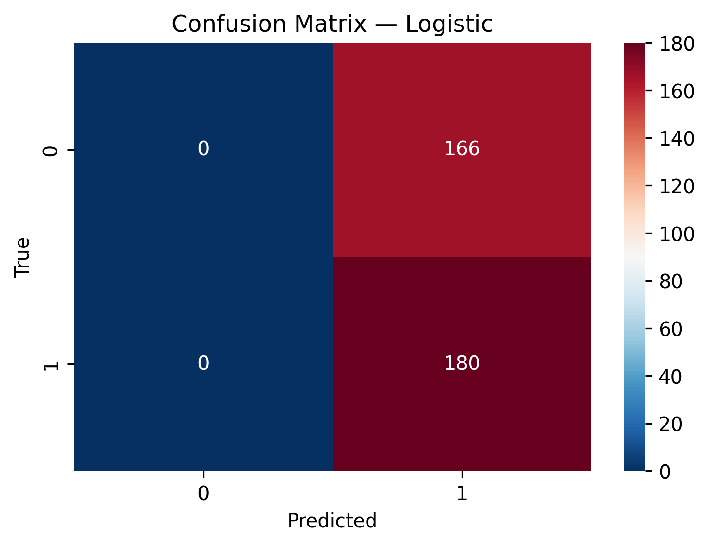

# Predicting Bitcoin Price Movements Using Gold Dollar Volume Change

## 1. Problem Framing & Scoping
The objective of this project is to explore whether **gold market activity** (specifically the change rate of Gold Close Price × Volume, i.e., Gold dollar volume change) can help predict **Bitcoin’s short-term price movements**.  

We test this hypothesis using both regression (predicting next-day returns) and classification (predicting up vs. down) models.

---

## 2. Data Acquisition & Storage
- **Source:** Yahoo Finance (`yfinance` Python package)  
- **Assets:** Gold Futures (`GC=F`) and Bitcoin (`BTC-USD`)  
- **Fields Used:** Close price and Volume  
- **Derived Features:**  
  - Gold dollar volume = Gold_Close × Gold_Volume  
  - Daily percentage change in dollar volume = `Gold_dv_chg`  
  - Target = Bitcoin next-day return (`BTC_ret`) or direction (`BTC_up`)  

Data is stored in a structured DataFrame and processed to remove missing and infinite values.

---

## 3. Data Preprocessing & Feature Engineering
- Computed **returns** and **lag features**  
- Constructed the main explanatory variable: **Gold_dv_chg**  
- Removed NaN and Inf values to ensure model training compatibility  

---

## 4. Exploratory Data Analysis (EDA)
- Plotted time series of Gold and Bitcoin prices  
- Compared returns distribution  
- Observed weak and unstable correlation between Gold and Bitcoin  

**Finding:** There is **no stable short-term relationship** between gold liquidity shocks and Bitcoin daily returns.

---

## 5. Modeling
Two approaches were tested:  

- **Regression (Linear Regression)**  
  - MAE ≈ 0.024  
  - RMSE ≈ 0.034  
  - R² ≈ -0.005 (worse than mean prediction)  

- **Classification (Logistic Regression, up vs. down)**  
  - Accuracy ≈ 52%  
  - F1 Score ≈ 0.68 (caused by predicting “up” for all cases)  
  - Confusion Matrix showed degenerate behavior: model always predicts “up”  

### Confusion Matrix Visualization

---

## 6. Evaluation & Risk Communication
- **Result:** Gold dollar volume change alone **does not provide predictive power** for Bitcoin price movements.  
- **Risk Communication:**  
  - Single-feature models are unreliable in financial forecasting.  
  - Crypto returns are highly noisy and influenced by multiple factors (macro, sentiment, regulation).  
  - Relying on such a weak signal could mislead risk managers or traders.  

---

## 7. Results Reporting & Stakeholder Communication
**Key Takeaway:**  
> Gold liquidity (measured by dollar volume change) is **not a reliable predictor** of Bitcoin’s short-term price movements.  

**Implications for Stakeholders (Investors / Risk Managers):**
- Gold market activity should not be used in isolation for Bitcoin forecasting.  
- Over-reliance on this factor could result in poor risk management and overconfidence.  
- A more robust model requires **multiple features** (macro indicators, lagged Bitcoin factors, volatility, sentiment data) and possibly **non-linear models**.

---

## 8. Future Work & Productization Outlook
If this analysis were to be extended into production:
- **Feature Expansion:** Incorporate multiple factors beyond gold (e.g., USD index, interest rates, volatility indices, crypto-specific on-chain metrics).  
- **Modeling:** Explore non-linear approaches such as Random Forests, Gradient Boosting, or LSTMs.  
- **Productization:** Deploy as a monitoring dashboard (e.g., daily signals for BTC direction).  
- **Monitoring:** Continuously evaluate accuracy with new data, track model drift, and update features as necessary.  

---

## 9. Conclusion
This project demonstrates an **end-to-end ML lifecycle** on financial data:  
- Problem framing → Data acquisition → Preprocessing → EDA → Feature engineering → Modeling → Evaluation → Reporting.  
The analysis provides a **negative but meaningful result**: gold liquidity by itself does not predict Bitcoin price direction. This reinforces the need for multi-factor approaches in quantitative finance.
